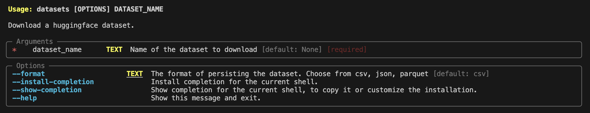

# datasets_saver
Export Huggingface datasets in persistable formats uing CLI.

## Installation

1. Clone the repo
2. Install using pip `pip install .`
3. Now it is available as a CLI command.

## CLI Interface

`datasets download --help`

Example: `datasets download imdb` downloads the imdb dataset and persists it in `csv` format.
The default output location is `~/saved_datasets/`.s

A dataset can be saved in `csv`, `json` and `parquet` files.

All the splits/files of a dataset are downloaded and stored separately.